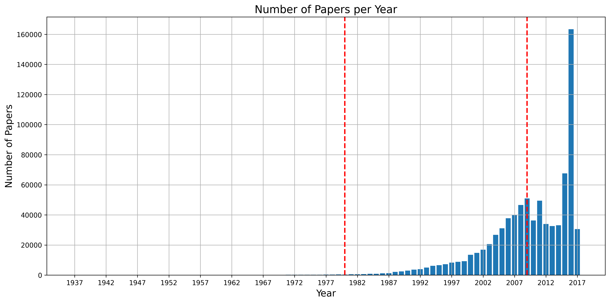
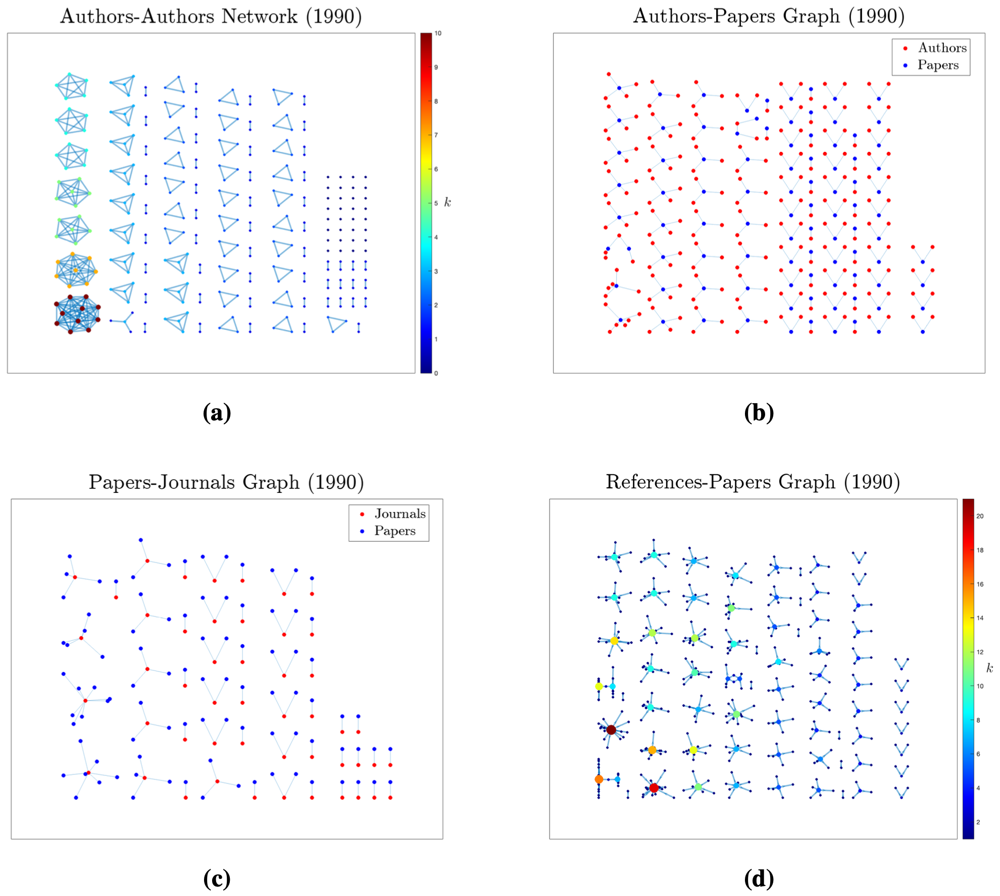

# Analysis Of Changes In Scientific Research Through Graph Theory

## Overview

This project examines the evolution of co-authorship collaborations in academic research using network analysis and temporal data. The study focuses on two main areas:

1. Analysis of the number and volume of papers produced over the years.
2. Identification of trending topics and the most popular journals over the years.

The final objective is to provide an overview of the research evolution from 1980 to 2009 from historical-technological and socio-professional perspectives.

## Dataset

The used dataset has been taken from Kaggle: 
https://www.kaggle.com/datasets/nechbamohammed/research-papers-dataset

Before using it a sampling procedure has been performed in order to reduce the data dimension. Just the elements not containg NaN and published between 1980 and 2009 has been taken.

These procedures have been performed through Python library Pandas.

## Analyzed Graphs

The four analyzed graphs are:

- **Authors-Authors Graph:** Is a non-oriented unweighted graph, where nodes $n$ represent the authors and links $l_{mn}$ represent a collaboration between researcher $m$ and $n$.

- **References-Papers Graph:** Is an oriented unweighted graph, where nodes $n$ represent different papers and links $l_{mn}$ represent the citation made by node $m$ of node $n$.

- **Papers-Journals Graph:** Is a bipartite unoriented graph, where nodes $u \in \mathcal{U}$ are papers and nodes $v \in \mathcal{V}$ are journals. A link $l_{uv}$ represent that paper $u$ is published on journal $v$.

- **Authors-Papers Graph:** Is a bipartite unoriented graph, where nodes $u \in \mathcal{U}$ are authors and nodes $v \in \mathcal{V}$ are papers. A link $l_{uv}$ represent that author $u$ has contributed to the publication of paper $v$.

**NOTE:** Analysis are not conducted just on 1990 year. Four graphs like these have been created for each year spanning form 1980 to 2009.

## Analysis

To carry out the analysis the following metrics have been used:

- **Node degree:** $k_i$, for the $i$-th node

- **Average Node degree:** $\langle k \rangle = \frac{1}{N}\sum_{i \in \mathcal{N}}{k_i}$

- **Node degree distribution:** 
$P(k_i=k) = \frac{\mu^k}{k!} e^{-\mu}$ (Poissonian), $P(k_i=k) = ck^{-\alpha}$ (Power-law)

- **Average path length:** $\langle d \rangle = \frac{1}{|\mathcal{N}_{sp}|}\sum_{i \in \mathcal{N}_{sp}}(d_i)$, where $\mathcal{N}_{sp} = \{n_1m_1, n_1m_2, ...\}$ is the set of all the possible connected pairs of nodes in the graph.

- **Assortativity (undirected graph):** $r = \frac{L^{-1} \sum\limits_{(m,n) \in\mathcal{N}} k_m k_n - \left[ L^{-1} \sum\limits_{(m,n) \in \mathcal{N}} \frac{1}{2} \left( k_m + k_n \right) \right]^2}
          {L^{-1} \sum\limits_{(m,n) \in \mathcal{N}} \frac{1}{2} \left( k_m^2 + k_n^2 \right) - \left[ L^{-1} \sum\limits_{(m,n) \in \mathcal{N}} \frac{1}{2} \left( k_m + k_n \right) \right]^2}$, where $L$ is the number of links in the network.

- **Assortativity (directed graph):** $r^\rightarrow = \frac{L^{-1} \sum\limits_{(m,n) \in\mathcal{N}} k^{out}_m k^{in}_n - \left[ L^{-1} \sum\limits_{(m,n) \in \mathcal{N}} \frac{1}{2} \left( k^{out}_m + k^{in}_n \right) \right]^2}{L^{-1} \sum\limits_{(m,n) \in \mathcal{N}} \frac{1}{2} \left( (k_m^{out})^2 + (k_n^{in})^2 \right) - \left[ L^{-1} \sum\limits_{(m,n) \in \mathcal{N}} \frac{1}{2} \left( k_m^{out} + k_n^{in} \right) \right]^2}$, where $L$ is the number of links in the network.

- **Betweenness centrality:**  $B_C(i) = \sum_{n \neq i \neq m}\Bigl({\frac{\sigma_{nm}(i)}{\sigma_{nm}}\Bigl)}$, where $\sigma_{nm}(i)$ represents the number of shortest path between node $n$ and $m$ that pass through node $i$, and
$\sigma_{nm}$ represents the number of shortest path between node $n$ and $m$.

All the analysis have been computed using Matlab, in particular through the BC Toolbox: https://sites.google.com/site/bctnet

## Conclusion

Has been observed how the importance of research is increasingly central nowadays, not only in academia.
This has led to great strides in technology and an increase in the number of annual publications.
Some final considerations, currently supported only on personal experiences and those of acquaintances working in academia, may reveal some negative aspects of the increasing number in publications.

(For more detailed considerations and explanation of the actual results please read the report)

## Limits

The main technical limitation encountered during this work is due to the use of a small amount of data compared to the total available. Although data were taken randomly, this may not have been sufficient to eliminate some bias that led to erroneous or inaccurate conclusions.

A limitation of human nature, on the other hand, is that this work was done by one person. As also evidenced by the data, collaboration is essential to be able to compare and develop more complex and effective ideas. 
